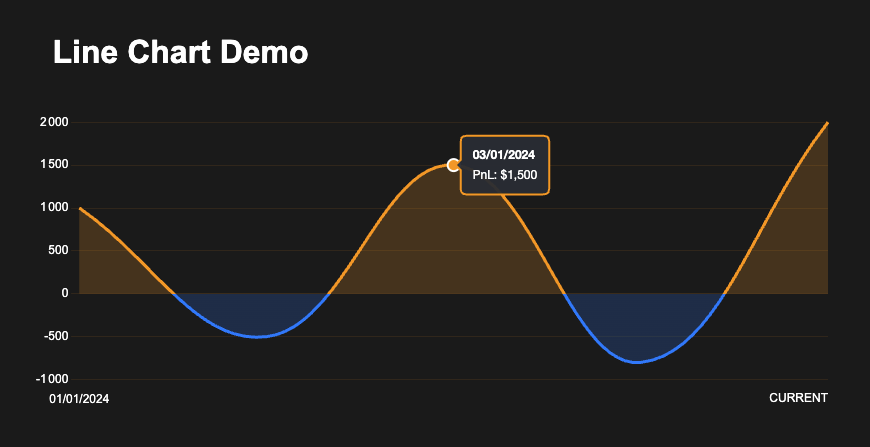
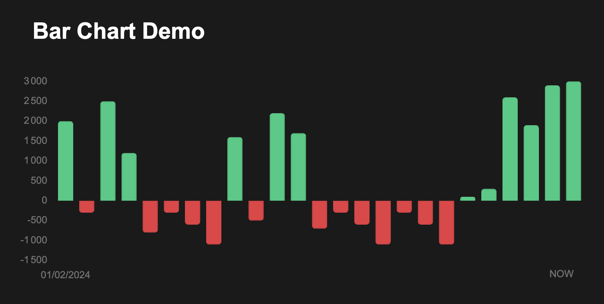

# Orderly Charts

A powerful React charting library designed for Orderly Network data visualization.
Built on Chart.js, this library provides elegant, interactive, and customizable charts optimized for financial data display.

## Features

Our library offers a comprehensive set of features tailored for financial data visualization:

- Fully customizable styling to match your application's theme
- Responsive design that adapts to any screen size
- Dark mode optimization for better visibility
- Complete TypeScript support for enhanced development experience
- Smooth animations and transitions
- Interactive tooltips with detailed data display

## Installation

Install the package and its peer dependency using your preferred package manager:

```bash
npm install @novee/orderly-charts chart.js
# or
yarn add @novee/orderly-charts chart.js
```

## Components

### Line Chart Component

The LineChart component provides a flexible way to visualize time-series data with customizable data types. This component is particularly useful for displaying financial or performance metrics over time.

#### Component Usage

The LineChart component accepts three key props:

- `height`: Defines the chart height (e.g., "300px")
- `data`: An array of data points containing a date and value pairs
- `type`: A string identifier for the data being displayed, used in tooltips and labels

#### Data Structure

Your data array should contain objects with at least two properties:

1. A `date` field in "YYYY-MM-DD" format
2. A value field whose name matches the `type` prop (case-insensitive)

For example, if you're tracking PnL (Profit and Loss), your data structure would look like this:

```typescript
const data = [
  {
    date: "2024-01-01",
    pnl: 1000,
  },
  {
    date: "2024-01-02",
    pnl: -500,
  },
];
```

#### Type Prop Flexibility

The `type` prop is case-insensitive, meaning both the following examples will work:

```typescript
<LineChart type="pnl" ... />
<LineChart type="PNL" ... />
```

However, it's important to ensure that the type string matches your data property name (ignoring case). The specified type will be used in tooltips and chart labels, so choose a display-friendly format like "PnL" for better readability.

### Bar Chart Component

The BarChart component provides an intuitive way to visualize discrete data points over time, making it especially suitable for financial metrics, trading volumes, and comparative analysis.

#### Component Usage

The BarChart component requires three essential props:

- `height`: Determines the vertical size of your chart (for example, "300px")
- `data`: Takes an array of data points where each point contains date and value information
- `type`: Indicates what kind of data you're displaying, which affects tooltips and labels

#### Data Structure

Your data needs to follow a specific structure to work properly with the BarChart. Each object in your data array must include:

1. A `date` field formatted as "YYYY-MM-DD"
2. A value field that corresponds to your chosen `type` prop

Here's a practical example for tracking trading volume:

```typescript
const data = [
  {
    date: "2024-01-01",
    volume: 5000,
  },
  {
    date: "2024-01-02",
    volume: 3000,
  },
];
```

#### Type Prop Flexibility

The BarChart component is designed to be flexible with naming conventions. The `type` prop is case-insensitive, which means all these variations will work:

```typescript
<BarChart type="volume" ... />
<BarChart type="Volume" ... />
<BarChart type="VOLUME" ... />
```

## Type Definitions

### UserHistory Interface

```typescript
export interface UserHistory {
  // Required date field for time-series data
  date: string;

  // Dynamic fields support for various metrics
  [key: string]: number | string;
}
```

### Chart Props

Both chart types share several customization options through props:

```typescript
export interface ChartProps {
  // Required props
  data: UserHistory[]; // Array of data points
  type: string; // Metric to display (e.g., "PnL", "Volume")
  height: string; // Chart height (e.g., "300px")

  // Bar styling
  barPositiveColor?: string; // Color for positive values (default: "rgb(14 203 129)")
  barNegativeColor?: string; // Color for negative values (default: "rgb(234 57 67)")
  barBorderWidth?: number; // Width of bar borders (default: 1)
  barBorderRadius?: number; // Border radius of bars (default: 4)

  // Tooltip configuration
  tooltipBackground?: string; // Background color (default: rgba(30, 30, 30, 0.8))
  tooltipTitleColor?: string; // Title text color
  tooltipBodyColor?: string; // Body text color
  tooltipBorderColor?: string; // Border color
  tooltipBorderWidth?: number; // Border width
  tooltipDisplayColors?: boolean; // Show/hide color indicators
  tooltipPadding?: number; // Internal padding
  tooltipCornerRadius?: number; // Border radius

  // Grid and axis styling
  gridDisplay?: boolean; // Show/hide gridlines
  gridColor?: string; // Grid line color
  axisColor?: string; // Axis label color
  axisFontSize?: number; // Axis label size
  axisFontFamily?: string; // Axis label font
  axisPadding?: number; // Axis padding

  // Animation and features
  enableAnimation?: boolean; // Enable/disable animations
  animationDuration?: number; // Animation duration in ms
  enableNowLabel?: boolean; // Show/hide current time marker
  nowLabelColor?: string; // Marker color
  nowLabelFontSize?: number; // Marker text size
}
```

### Line Chart Specific Props

```typescript
export interface LineChartProps extends ChartProps {
  // Line styling
  linePositiveColor?: string; // Color for positive trend line
  lineNegativeColor?: string; // Color for negative trend line
  lineWidth?: number; // Line thickness (default: 2)
  lineTension?: number; // Line smoothing (0-1, default: 0.4)

  // Fill styling
  fillPositiveColor?: string; // Area fill color above zero
  fillNegativeColor?: string; // Area fill color below zero
  fillOpacity?: number; // Fill transparency (0-1)

  // Point styling
  pointRadius?: number; // Size of data points
  pointHoverRadius?: number; // Size of points on hover
  pointBorderWidth?: number; // Width of point borders
  pointBorderColor?: string; // Color of point borders

  // Additional options
  nowLabelText?: string; // Custom text for current time marker
}
```

## Exemple:





## Advanced Usage Examples

### Customized Bar Chart

```typescript
<BarChart
  data={data}
  type="Trading Volume"
  height="300px"
  barPositiveColor="rgba(76, 175, 80, 0.8)"
  barNegativeColor="rgba(244, 67, 54, 0.8)"
  barBorderWidth={2}
  barBorderRadius={6}
  tooltipBackground="rgba(33, 33, 33, 0.95)"
  tooltipBorderColor="#4CAF50"
  gridDisplay={true}
  enableAnimation={true}
/>
```

### Customized Line Chart

```typescript
<LineChart
  data={lineData}
  type="PnL"
  height="300px"
  linePositiveColor="rgb(255, 140, 0)"
  lineNegativeColor="rgb(0, 122, 255)"
  fillPositiveColor="rgba(255, 140, 0, 0.2)"
  fillNegativeColor="rgba(0, 122, 255, 0.2)"
  lineWidth={3}
  lineTension={0.4}
  tooltipBorderColor="#FF8C00"
  enableAnimation={true}
/>
```

## Contributing

We welcome contributions from the community! Please feel free to submit a Pull Request.

## License

MIT © 2024 Novee
